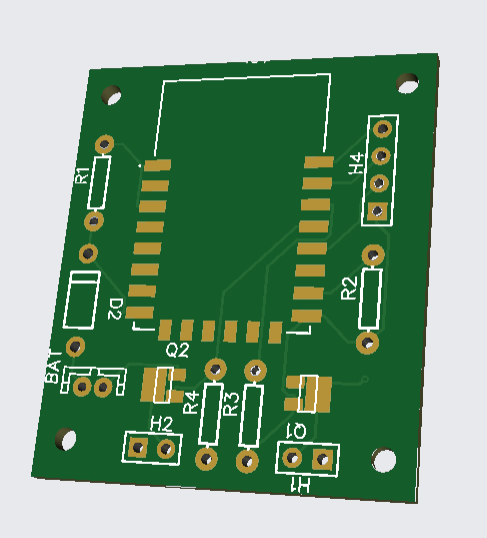

# VIMANA-STEM-LIGHT
The LIGHT version works with the prior ESP12E/ESP12F or other ESP8266 controllers.
This project is a fork without the need of N76E003. The main features is to use the controls of the new app to control two motors and servos.
You can use the unused ports to controll additional servos (not yet implemented).
If you need more, feel free to contribute.
Thank you to Ravi for his work.

You will find the Anrdoid App in the folder Andorid.

The Original Github repo for VIMANA2 Opensource Flightcontroller Board for Tiny Smartphone controlled Air plane and other moving/flying/floating things you will find on following links.
 Suitable for STEM Education 
Project Documentation : https://hackaday.io/project/190462-vimana-stem-for-all  
Youtube Playlist : https://www.youtube.com/playlist?list=PL6rHZ-FYvZtEZ2F3nPtqbe_Y3SMQ8Gjly  

## Features
- fully compatible to the first release of Ravis hardware
- supports two motors
- sending RSSI to mobile device
- sending battery voltage of receiver to mobile device

## Schematic

| Board Pins         |     | Device Pin         | Device Name             |   
|--------------------|-----|--------------------|-------------------------|   
| GPIO 04            | G   | Gain               | Motor right Si2302DS    |   
| GPIO 05            | G   | Gain               | Motor left Si2302DS     |   

