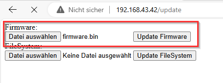
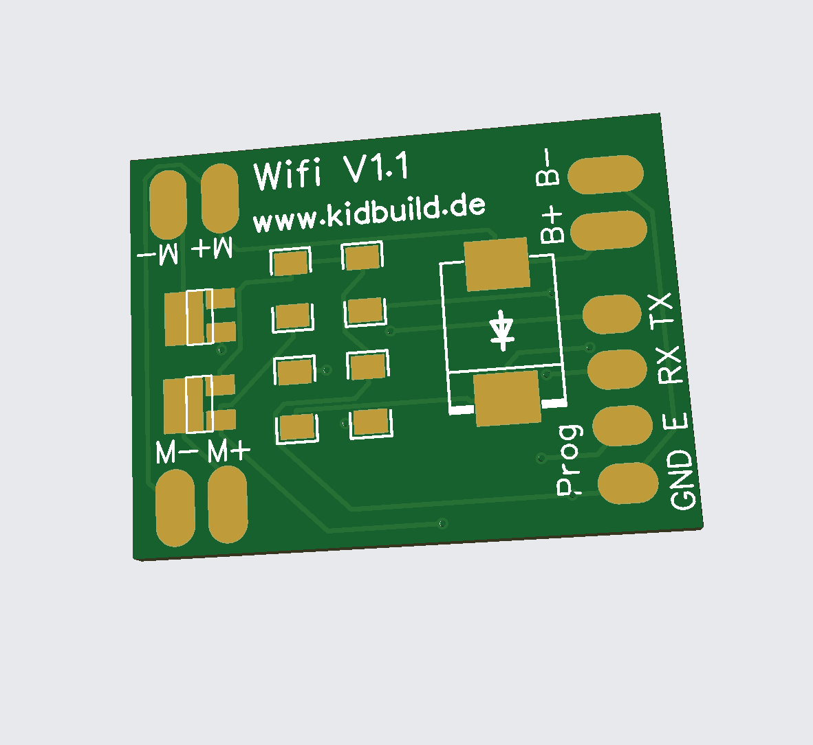
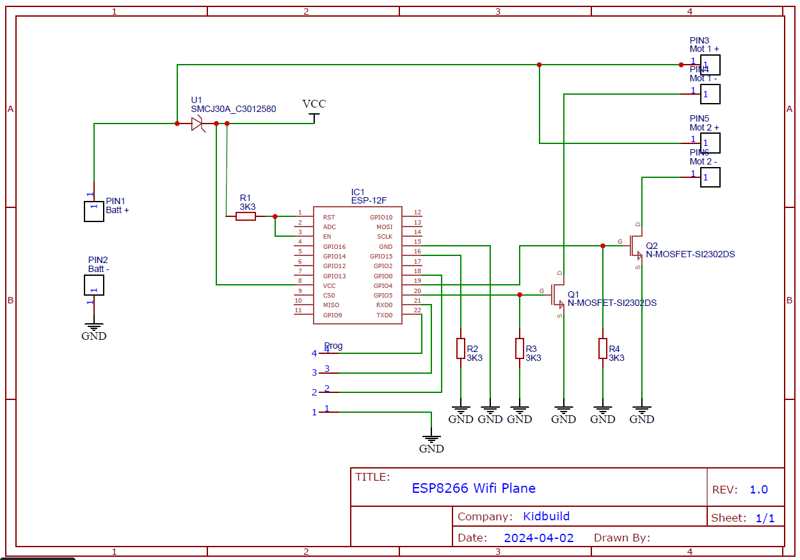
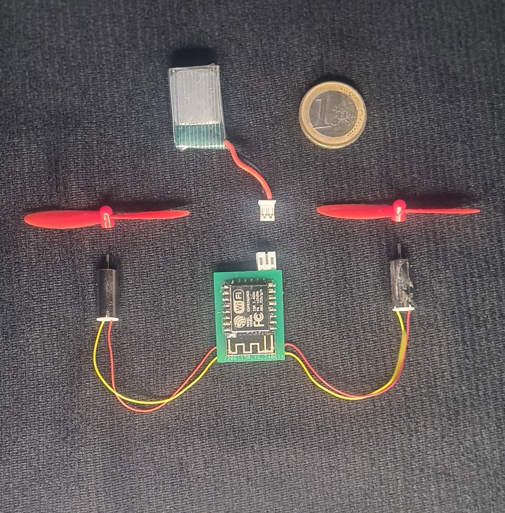
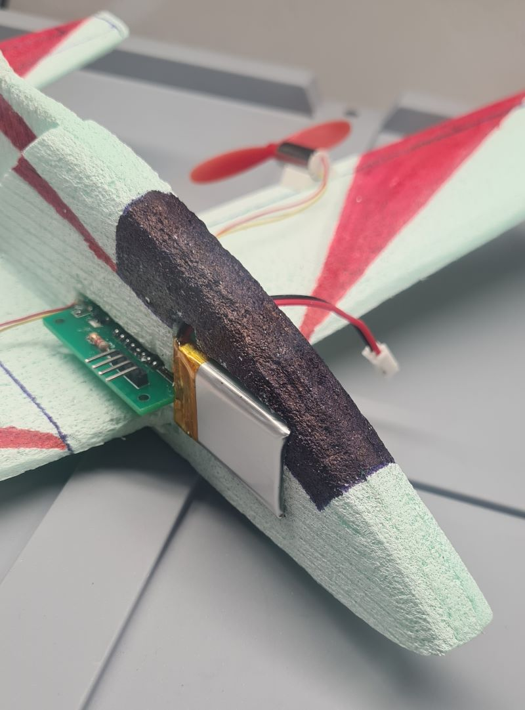
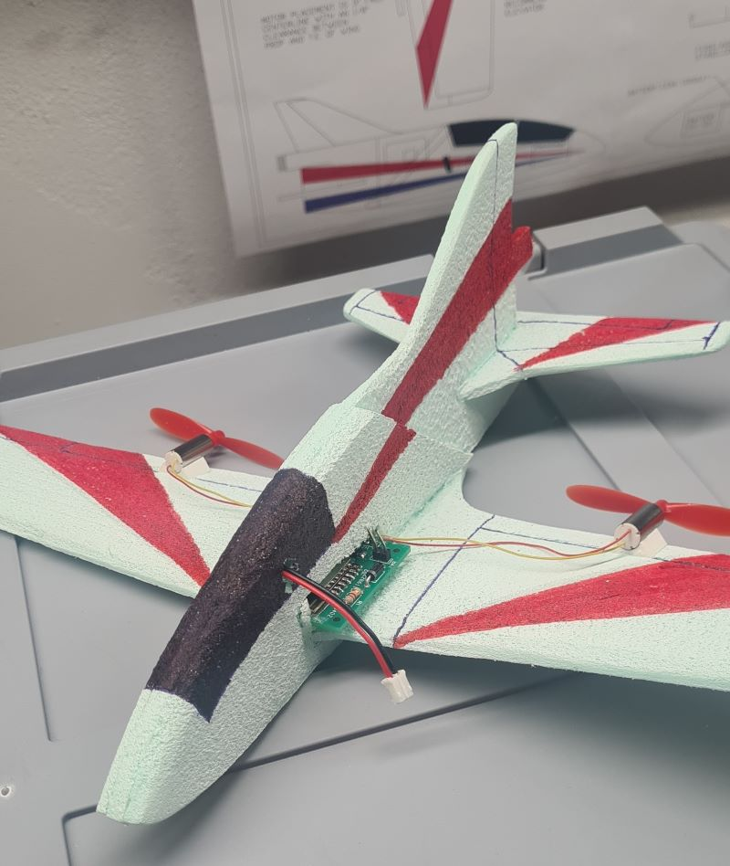

# VIMANA-STEM-LIGHT
The LIGHT version works with the prior ESP12E/ESP12F or other ESP8266 controllers.
This project is a fork without the need of N76E003. The main features is to use the controls of the new app to control two motors and servos.
You can use the unused ports to controll additional servos (not yet implemented).
If you need more, feel free to contribute.
Thank you to Ravi for his work.

You will find the Anrdoid App in the folder Andorid.

The Original Github repo for VIMANA2 Opensource Flightcontroller Board for Tiny Smartphone controlled Air plane and other moving/flying/floating things you will find on following links.
 Suitable for STEM Education 
Project Documentation : https://hackaday.io/project/190462-vimana-stem-for-all  
Youtube Playlist : https://www.youtube.com/playlist?list=PL6rHZ-FYvZtEZ2F3nPtqbe_Y3SMQ8Gjly  

## Features
- fully compatible to the first release of Ravis hardware
- supports two motors
- sending RSSI to mobile device
- sending battery voltage of receiver to mobile device
- calibrate motors
- update firmware via OTA http://192.168.43.42/update

## Schematic

| Board Pins         |     | Device Pin         | Device Name             |   
|--------------------|-----|--------------------|-------------------------|   
| GPIO 04            | G   | Gain               | Motor right Si2302DS    |   
| GPIO 05            | G   | Gain               | Motor left Si2302DS     |   

## Folders

- CAD --> Plane cutouts for laser or cnc or by hand and pdf paper  
- Gerber --> Gerber files for PCB   
- src --> Source files for Platformio

## Flashing firmware

To flash the board, use UART to USB adapter. Do it in this step´s to enable flashing mode of ESP
1. Connect the pins to the UART adapter (GND, TX, RX)   
2. Connect E-pin to GND
3. Plug in the battery
4. Flash the ESP

## Updating firmware

The firmware includes OTA (Over-The-Air Update).
You can easily upload the compiled firmware file (firmware.bin) via web-browser.
Connect to the Wifi accesspoint of the plane, open the browser and type in the following url.
http://192.168.43.42/update

Click on select file and upload the firmware (this takes some seconds). The click on Update Firmware.

## ToDo
- adding pins D1 (GPIO5), D2 (GPIO4), GND, VCC  (for future use of MPU6050)
- adding pins GPIO12, GND, VCC (Servo elevator)
- adding pins GPIO13, GND, VCC (Servo ruder)

